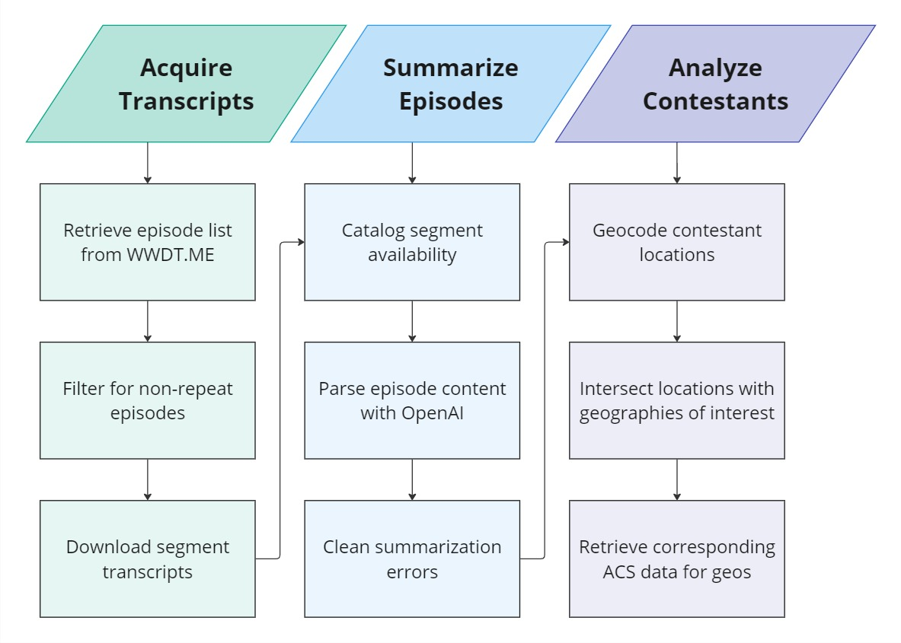
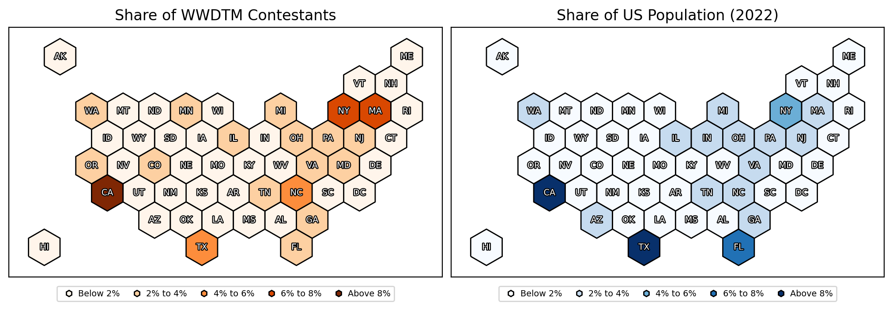
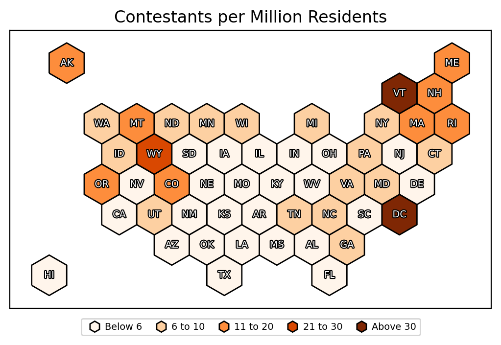
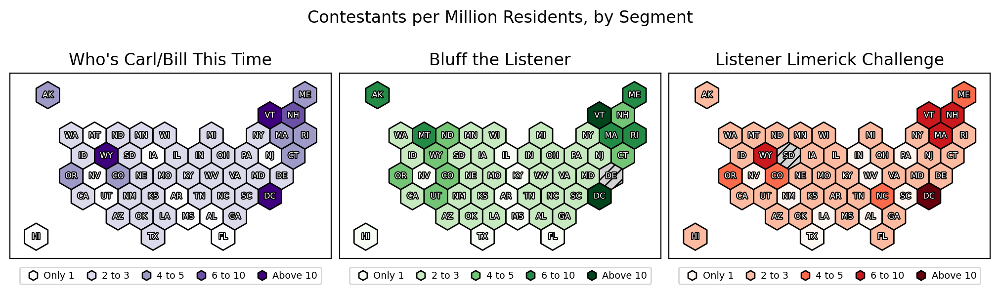
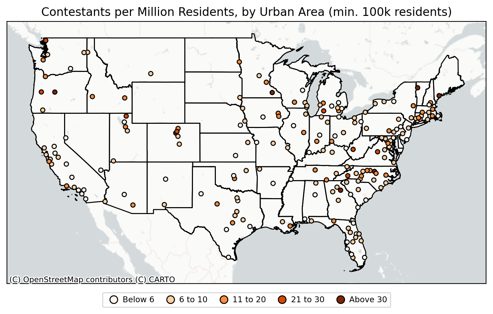
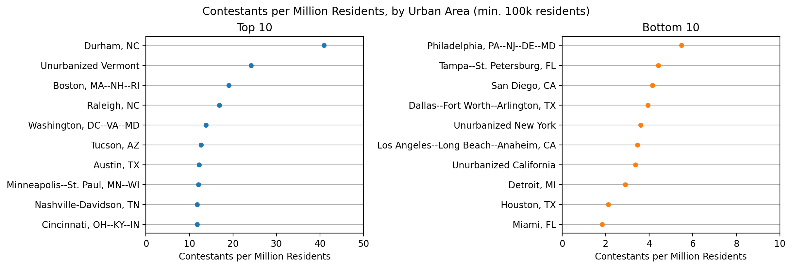
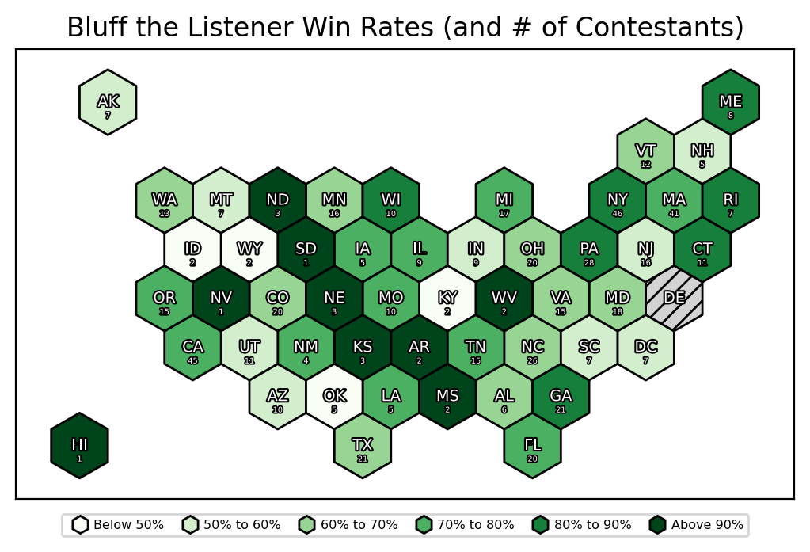
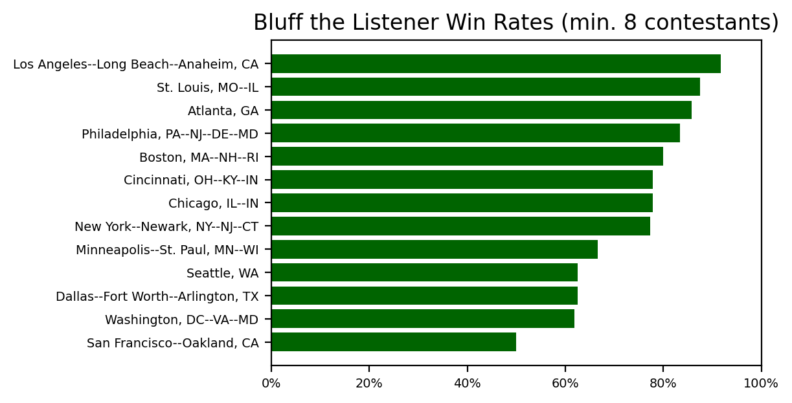
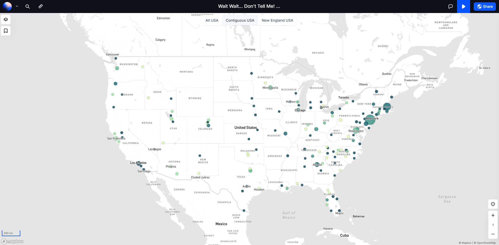

# LLM-Assisted Data Mining with the Transcripts of _Wait Wait... Don't Tell Me!_

## TL;DR
> - While California and New York have the most callers in to Wait Wait Don't Tell Me, smaller states such as Vermont, Washington DC, and Wyoming send more callers-per-capita
> - Callers are overwhelmingly likely to urban, living in a large city of some sort, and appear to skew towards college towns
> - Bluff the Listener win rates average 73%, but Los Angeles outperforms this average considerably
> - Play around with a dynamic map showing all of this data and more [here](https://app.atlas.co/projects/tc4uAKruNghr0dUSmqmE?public=true)!

## Introduction

One of the most intriguing uses I've come across for LLMs like ChatGPT is their ability to extract structured data from text documents. Initially playing around with [JSON Mode](https://platform.openai.com/docs/guides/structured-outputs/json-mode), and later with the more fully-featured [Structured Outputs](https://platform.openai.com/docs/guides/structured-outputs) offered by OpenAI, I had the idea of using this capability to answer a series of long-held questions I had about my favorite podcast: _[Wait Wait... Don't Tell Me!](https://www.npr.org/programs/wait-wait-dont-tell-me)_

I've been an avid listener of _WWDTM_, NPR's weekly news quiz show for as long as I can remember (and am even a one-time listener contestant). While [a certain fan site](https://stats.wwdt.me/) has been tracking many of the statistics of the long-running series, I noticed that there was a gap related to those calling in, namely (1) where they were from and (2) if they won the game they played, which I thought an LLM should be able to answer relatively trivially.

### A Note on Code

This code utilized web-scraping modules in Python to download transcripts offline for mining purposes. As I am unsure on the legality of this, even for personal use, I am not providing the actual code I used here, to spare their servers from anyone potentially following in my footsteps[^code_note].

---

## Workflow

This project was undertaken in more-or-less 3 parts:



### Step 01: Acquire Transcripts

The fan site linked above, [WWDT.ME](https://stats.wwdt.me/), has direct links to the show pages for (almost) every episode on NPR's website[^show_links], which can be downloaded via API. The resulting table also includes flags to help exclude `best_of` and `repeat` shows, which were utilized to return a unique list of "classic" episodes.

Just because an episode was listed, however, didn't mean it had transcripts available for it, or a list of the segments contained within. Specifically, episodes generally took one of three forms:

- **Jan 2006 to Mar 2010**: Episodes are broken out by segments, but do not contain transcripts ([example](https://www.npr.org/programs/wait-wait-dont-tell-me/2006/05/27/13052286/?showDate=2006-05-27))[^transcripts]
- **Mar 2010 to June 2021**: Episodes are broken out by segments, and almost all segments have a transcript ([example](https://www.npr.org/programs/wait-wait-dont-tell-me/319455509/wait-wait-dont-tell-me-for-june-14-2014?showDate=2014-06-14))
- **June 2021 to Present**: Episodes are considered a single segment, and almost all episodes have a transcript ([example](https://www.npr.org/programs/wait-wait-dont-tell-me/2024/08/03/wait-wait-dont-tell-me-for-august-03-2024?showDate=2024-08-03))

Only the first two types of episodes were included in this analysis, meaning the total dataset spans March 2010 to July 2024, or around ~600 episodes. For each episode, a combination of `requests` and `BeautifulSoup` was used to locate and download the transcript, as well as combine single-segment transcripts together to make full-episode ones.

### Step 02: Summarize Episodes

After playing around with a few ad-hoc requests in ChatGPT, I determined that false positive contestant identification could be reduced if I *pre-emptively* told the LLM *which segments I wanted to extract contestant information for* - a common mistake happened when a transcript was not available for a given segment, but I asked for contestant information anyways, leading the LLM to "force fill" a "contestant's" info incorrectly (usually with a comedian panelist's info instead).

Thus, the first step was to use simple regex searches to do a conservative search of the "storytext" ([example](https://www.npr.org/2024/08/03/g-s1-15130/wait-wait-for-august-3-2024-live-at-wolf-trap-with-dr-fauci)) of each episode for the keywords of the segment I wanted to collect data from: Who's Carl/Bill This Time, Bluff the Listener, and the Listener Limerick Challenge (sometimes referred to as just "Limericks").

With this in hand, the request to the LLM could then be constructed. A two-step nested `pydantic` structure was utilized, taking the (simplified[^pydantic]) form of:

```python
class ContestantInfo(pydantic.BaseModel):
    contestant_name: str # note: this was mainly just to help me validate
    contestant_place: str | None
    winner: bool
    model_config = {"extra":"forbid"}

class EpisodeInfo(pydantic.BaseModel):
    host_quote: list[ContestantInfo]
    bluff_listener: list[ContestantInfo]
    limerick: list[ContestantInfo]
    model_config = {"extra":"forbid"}
```

Where only the segments that were available for that specific episode were passed along to the `Structured Outputs` instructions.

Given the relatively simple nature of this request, I used the cheaper `gpt-4o-mini` endpoint. Combined with the batch processing functionality (which reduces each request's costs by 50%[^batch]) all the transcripts were analyzed in just a few hours ***for less than $1 total***.

A quick validation of the data revealed <100 verifiable mistakes, either in the form of multiple contestants being mistakenly included in the same segment, or one contestant showing up across multiple segments, which could be corrected programatically. 

I did also spot-check about a dozen individual episodes that didn't have any errors associated with them, and they all seemed correct, so for the purposes of this project I considered that "good enough".

### Step 03: Analyze Contestants

Most of my interest lay in the geographic distribution of callers, so I first began by geocoding each contestant's location with the `geopy` package, first with the (free) Nominatim service from OpenStreetMap, and then with Google Maps' more powerful (and paid) geocoding service for the few locations that returned errors[^loc_error].

With each location geocoded, I then looked to *aggregate* the data based on common geographies. Using `pygris`, I downloaded a set of shapefiles from the US Census Bureau[^usa] covering a range of different scales: states, counties, core-based statistical areas, urban areas, and places[^hierarchy]. For each of these, I intersected the contestant locations with the shapefile in `geopandas`, thereby ascertaining which geography it fell in (or none at all, if it was outside of all of them), allocating each contestant to its relevant states/county/CBSA/etc.

After, I queried the Census Bureau's [American Community Survey API](https://www.census.gov/programs-surveys/acs/data/data-via-api.html), pulling key population, demographic, and economic information at each geographic level, which I planned to use in my analysis.

*Note that, after visually inspecting most geographies, I determined that the two most interesting and relevant are at the level of the state and urban areas, and so the bulk of this analysis is focused on those.*

---

## Findings

### Which States Have the Most Contestants?

NPR in general is considered a ["lean-left" newsroom](https://www.allsides.com/news-source/npr-editorial), which means you might expect the most callers to come from left-leaning states, and indeed this is what you find if you just look at the *total* number of contestants that come from each state. But oftentimes such a map is really just a *population* map, given that a state with more people is *generally* expected to have more callers (see: California; counterpoint: Florida) - expand the header below to compare for yourself.

<details>
<summary><strong><font size="+1">Contestants and Population Share by State</font></strong></summary>



</details>
<br>

Instead, a more indicative map would *normalize* the population by the number of residents in a given state, as shown below:

<details open>
<summary><strong><font size="+1">Contestants per Million Residents (CPM) by State</font></strong></summary>



</details>
<br>

This map shows that large, "lean-left" states like California and New York actually *underperform* nationally, with smaller states like Vermont, Washington DC, and even right-leaning Wyoming punching far above their weight in terms of contestants. 

This trend generally holds for individual segments too:

<details>
<summary><strong><font size="+1">Contestants per Million Residents (CPM) by State, by Show Segment</font></strong></summary>



</details>
<br>

### Which Cities Have the Most Contestants?

Most callers into the show identify themselves by both their "city" *and* state. What constitutes a "city" might be up for debate[^cities], but I found that Census-designated [*Urban Areas*](https://en.wikipedia.org/wiki/Urban_area) generally conform to what people expect when they say "cities".

First, a necessary caveat: *callers are **significantly** more likely to come from a city*. Just look at the table below:

| Category | Population | Contestants | CPM |
| -------- | ---------- | ----------- | --- |
| **Unurbanized** | 100M | 166 | 1.65 |
| **Urbanized** | 268M | 1615 | 6.01 |

While some of this is a function of the *incredibly generous* definition of an "urban area" used by the census[^urban_cpm], it is still clear that callers skew non-rural, at least: with only ~2.5x the population, urban areas have a whopping 10x the number of contestants!

Not every city is equal, however, as the map below demonstrates:

<details>
<summary><strong><font size="+1">Contestants per Million Residents (CPM) by Urban Area</font></strong></summary>



</details>
<br>

This wide variability is evident if we compare the top and bottom 10 urban areas:

<details open>
<summary><strong><font size="+1">Urban Areas Ranked by CPM</font></strong></summary>



</details>
<br>

While many "lean-left" cities do appear in the Top 10 list, many of these cities are also known for the presence of one or more large colleges, which could indicate the types of callers you might expect to the show leaning towards young and educated - as an interesting counterpoint, however, Philadelphia appears in the Bottom 10 list *despite* a large college population.

This chart also reveals that Vermont places high in the state rankings because of the population *outside* of Burlington, not within it, and that New York and California are "dragged down" in the rankings due to their unurbanized population as well - although the LA metro is "underperforming" too.

### Who is the Best at *Bluff the Listener*?

True *Wait Wait*-heads will agree that *Bluff the Listener* is the most difficult segment to call into, and the data bears this out: both *Who's Carl/Bill This Time* and the limerick challenge, which each give a caller three chances to get two correct answers, have a win rate close to 100%, whereas *Bluff the Listener*, with its one-shot format (and rare hints from the host) has a decidedly... *lower* win-rate:

<details open>
<summary><strong><font size="+1">Bluff the Listener Win Rate by State</font></strong></summary>



</details>
<br>

While there are some states that initially appear to be #killingit in the game, closer observation reveals that is simply a function of them only having a few contestants! States with more contestants approach the "true" average for the game of **~73%**.

Who has bragging rights at the *urban* level, however?

<details>
<summary><strong><font size="+1">Bluff the Listener Win Rate by Urban Area</font></strong></summary>



</details>
<br>

Despite underperorming overall in the number of contestants they send, Los Angeles at least sends their best!

### Dynamic Mapping

All of this data (and a bit more) is available at [this map](https://app.atlas.co/projects/tc4uAKruNghr0dUSmqmE?public=true) made at [Atlas.co](https://atlas.co/), which allows users to dynamically zoom into the areas they are most interested in - check it out!

<details>
<summary><strong><font size="+1">Screenshot of Atlas.co Map</font></strong></summary>



</details>
<br>

---

### Footnotes

[^code_note]: To anyone at NPR reading this: I would love an API!

[^show_links]: I actually helped the author of the site backfill this field in at the beginning of the year

[^transcripts]: I did entertain using Whisper to _generate_ segments for it, but ultimately discounted it for now

[^pydantic]: I did have some extra `pydantic.Field` attributes in here, usually to pass a description, but I've truncated that to make it more legible

[^batch]: I don't know why, but each of my batch requests were processed in only ~2 minutes, instead of the up-to-24-hours that the SLA allows for

[^loc_error]: Usually this occurred when the LLM returned a longer string than just the strict location name (such as *"Originally from Chicago"*)

[^usa]: The vast majority of callers are from the US, so most of my analysis is spent teasing out nuance within the country

[^hierarchy]: The explanation of these, in terms of rough descending scale, can be found [here](https://www2.census.gov/geo/pdfs/reference/geodiagram.pdf)

[^cities]: Callers might choose to identify with the nearest "big" city that is recognizable to a national audience over the smaller/lesser-known place they are actually located in, but for the purposes of this analysis, I assume that everyone is being truthful when giving their location

[^urban_cpm]: Including cities with a population <100k in the definition of "unurbanized" doesn't help the argument much - the Unurbanzed CPM only goes up to 2.79, while the Urbanized CPM increases to 6.11
